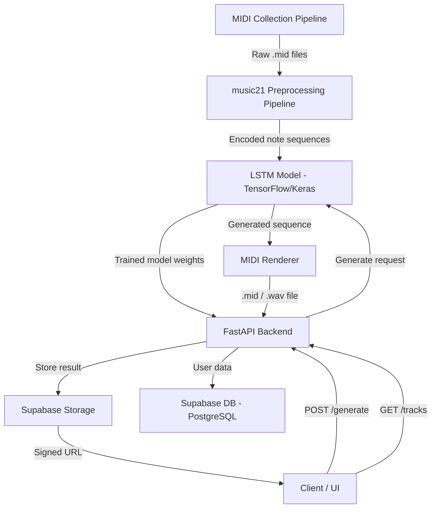
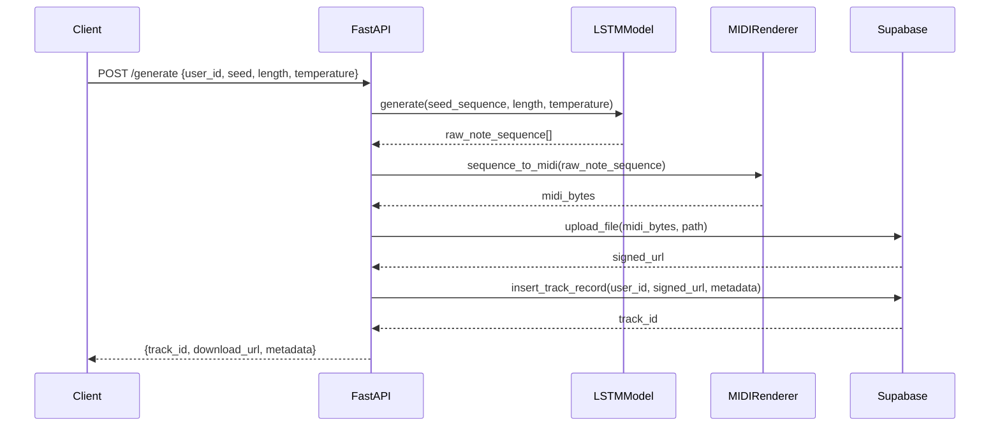
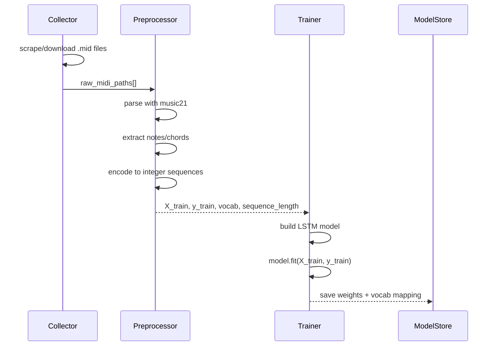

# Design Document: AI Music Generation

## Overview

This feature implements an end-to-end AI music generation system that collects MIDI files, preprocesses them using music21, trains an LSTM model with TensorFlow/Keras to learn musical patterns, and exposes a FastAPI backend for on-demand music generation. Generated compositions and user data are persisted in Supabase, enabling a scalable, cloud-backed music generation service.

The system is composed of four major subsystems: a MIDI collection pipeline, a music21-based preprocessing pipeline, an LSTM model training and inference engine, and a FastAPI service layer backed by Supabase for storage and user management.

The design prioritizes modularity — each pipeline stage is independently runnable and testable, with clear data contracts between stages. The FastAPI layer decouples the model from consumers, and Supabase provides a managed backend for persistence without requiring a custom database server.

---

## Architecture



---

## Sequence Diagrams

### Music Generation Flow



### MIDI Collection & Training Flow



---

## Components and Interfaces

### Component 1: MIDI Collection Pipeline

**Purpose**: Discovers, downloads, and validates raw MIDI files from configured sources (local directories, URLs, or dataset APIs).

**Interface**:
```python
class MIDICollector:
    def collect(self, sources: list[str]) -> list[Path]:
        """Collect MIDI files from given source paths or URLs."""
        ...

    def validate(self, path: Path) -> bool:
        """Return True if file is a valid, parseable MIDI file."""
        ...

    def deduplicate(self, paths: list[Path]) -> list[Path]:
        """Remove duplicate MIDI files by content hash."""
        ...
```

**Responsibilities**:
- Traverse local directories and download remote MIDI files
- Validate each file is parseable by music21
- Deduplicate by MD5/SHA256 content hash
- Emit a manifest file listing all collected paths

---

### Component 2: music21 Preprocessing Pipeline

**Purpose**: Parses MIDI files, extracts musical elements (notes, chords, rests), and encodes them into integer sequences suitable for LSTM training.

**Interface**:
```python
class MusicPreprocessor:
    def parse_midi(self, path: Path) -> music21.stream.Score:
        """Parse a MIDI file into a music21 Score object."""
        ...

    def extract_elements(self, score: music21.stream.Score) -> list[str]:
        """Extract notes, chords, and rests as string tokens."""
        ...

    def build_vocabulary(self, all_elements: list[list[str]]) -> dict[str, int]:
        """Build integer encoding vocabulary from all extracted elements."""
        ...

    def encode_sequences(
        self,
        elements: list[str],
        vocab: dict[str, int],
        sequence_length: int
    ) -> tuple[np.ndarray, np.ndarray]:
        """Produce (X, y) training arrays from encoded element sequences."""
        ...

    def decode_sequence(
        self,
        indices: list[int],
        vocab: dict[str, int]
    ) -> list[str]:
        """Convert integer indices back to note/chord tokens."""
        ...
```

**Responsibilities**:
- Handle polyphonic MIDI (flatten to single part or process per-instrument)
- Normalize note durations to quantized values
- Build and persist vocabulary mapping (token → int, int → token)
- Produce sliding-window (X, y) pairs for supervised LSTM training

---

### Component 3: LSTM Model (TensorFlow/Keras)

**Purpose**: Defines, trains, and runs inference on the sequence-to-sequence LSTM model for music generation.

**Interface**:
```python
class MusicLSTM:
    def build(
        self,
        vocab_size: int,
        sequence_length: int,
        embedding_dim: int = 64,
        lstm_units: int = 256,
        dropout: float = 0.3
    ) -> tf.keras.Model:
        """Construct and compile the LSTM model."""
        ...

    def train(
        self,
        X: np.ndarray,
        y: np.ndarray,
        epochs: int = 100,
        batch_size: int = 64,
        checkpoint_dir: Path = Path("checkpoints/")
    ) -> tf.keras.callbacks.History:
        """Train the model and save checkpoints."""
        ...

    def generate(
        self,
        seed_sequence: list[int],
        length: int = 128,
        temperature: float = 1.0
    ) -> list[int]:
        """Generate a sequence of note indices from a seed."""
        ...

    def load(self, weights_path: Path, vocab_path: Path) -> None:
        """Load saved weights and vocabulary for inference."""
        ...
```

**Responsibilities**:
- Embedding layer → stacked LSTM layers → Dense softmax output
- Temperature-scaled sampling during generation
- ModelCheckpoint and EarlyStopping callbacks during training
- Serialize/deserialize model weights and vocabulary

---

### Component 4: MIDI Renderer

**Purpose**: Converts decoded note/chord token sequences back into MIDI bytes for download or playback.

**Interface**:
```python
class MIDIRenderer:
    def sequence_to_midi(
        self,
        tokens: list[str],
        tempo: int = 120,
        instrument: str = "Piano"
    ) -> bytes:
        """Convert token sequence to MIDI file bytes."""
        ...

    def midi_to_audio(self, midi_bytes: bytes) -> bytes:
        """Optional: render MIDI to WAV using FluidSynth."""
        ...
```

---

### Component 5: FastAPI Backend

**Purpose**: Exposes REST endpoints for triggering generation, retrieving tracks, and managing user data.

**Interface**:
```python
# Routes
POST   /generate          # Trigger music generation
GET    /tracks            # List user's generated tracks
GET    /tracks/{track_id} # Get a specific track with download URL
DELETE /tracks/{track_id} # Delete a track
GET    /health            # Health check
```

---

### Component 6: Supabase Integration

**Purpose**: Provides PostgreSQL-backed storage for track metadata and user records, plus object storage for MIDI/audio files.

**Interface**:
```python
class SupabaseClient:
    def upload_midi(self, midi_bytes: bytes, user_id: str) -> str:
        """Upload MIDI bytes to Supabase Storage, return signed URL."""
        ...

    def insert_track(self, record: TrackRecord) -> str:
        """Insert track metadata into the tracks table, return track_id."""
        ...

    def get_tracks(self, user_id: str) -> list[TrackRecord]:
        """Fetch all tracks for a user."""
        ...

    def delete_track(self, track_id: str, user_id: str) -> None:
        """Delete track record and associated storage object."""
        ...
```

---

## Data Models

### GenerationRequest

```python
from pydantic import BaseModel, Field
from typing import Optional

class GenerationRequest(BaseModel):
    user_id: str
    seed_tokens: Optional[list[str]] = None   # Optional seed notes/chords
    length: int = Field(default=128, ge=16, le=512)
    temperature: float = Field(default=1.0, ge=0.1, le=2.0)
    tempo: int = Field(default=120, ge=40, le=240)
    instrument: str = "Piano"
```

**Validation Rules**:
- `length` must be between 16 and 512 tokens
- `temperature` must be between 0.1 and 2.0 (lower = more deterministic)
- `tempo` must be between 40 and 240 BPM

---

### TrackRecord

```python
class TrackRecord(BaseModel):
    track_id: str           # UUID, generated server-side
    user_id: str
    storage_path: str       # Supabase Storage object path
    download_url: str       # Signed URL (expires)
    length: int             # Number of tokens generated
    temperature: float
    tempo: int
    instrument: str
    created_at: datetime
    metadata: dict          # Arbitrary extra info (seed, model version, etc.)
```

---

### VocabularyMapping

```python
class VocabularyMapping(BaseModel):
    token_to_int: dict[str, int]   # e.g. {"C4": 0, "E4.G4": 1, ...}
    int_to_token: dict[int, str]
    vocab_size: int
    sequence_length: int
    created_at: datetime
    source_files_count: int
```

---

## Algorithmic Pseudocode

### Preprocessing Algorithm

```python
def preprocess_corpus(midi_paths: list[Path], sequence_length: int = 100):
    """
    Preconditions:
      - midi_paths is non-empty
      - all paths point to valid MIDI files
      - sequence_length >= 1

    Postconditions:
      - Returns (X, y, vocab) where X.shape == (N, sequence_length)
      - y.shape == (N, vocab_size) as one-hot vectors
      - vocab covers all unique tokens in corpus

    Loop Invariant (outer loop):
      - all_elements contains only valid token strings from previously processed files
    """
    all_elements: list[list[str]] = []

    for path in midi_paths:
        score = music21.converter.parse(str(path))
        elements = extract_elements(score)   # notes, chords, rests as strings
        all_elements.append(elements)

    flat_elements = [e for sublist in all_elements for e in sublist]
    vocab = build_vocabulary(flat_elements)

    X_list, y_list = [], []

    for elements in all_elements:
        encoded = [vocab.token_to_int[e] for e in elements]

        # Sliding window — loop invariant: all windows so far are length sequence_length
        for i in range(len(encoded) - sequence_length):
            X_list.append(encoded[i : i + sequence_length])
            y_list.append(encoded[i + sequence_length])

    X = np.array(X_list)                          # shape: (N, sequence_length)
    y = tf.keras.utils.to_categorical(y_list, num_classes=len(vocab.token_to_int))
    return X, y, vocab
```

---

### LSTM Generation Algorithm

```python
def generate_sequence(
    model: tf.keras.Model,
    seed: list[int],
    vocab: VocabularyMapping,
    length: int = 128,
    temperature: float = 1.0
) -> list[int]:
    """
    Preconditions:
      - len(seed) == model input sequence_length
      - all values in seed are valid vocab indices
      - 0.1 <= temperature <= 2.0
      - length >= 1

    Postconditions:
      - Returns list of length `length` containing valid vocab indices
      - All returned indices are in range [0, vocab_size)

    Loop Invariant:
      - At each step i, `current_sequence` contains exactly sequence_length valid indices
      - `output` contains i valid generated indices
    """
    current_sequence = list(seed)
    output: list[int] = []

    for _ in range(length):
        # current_sequence always has exactly sequence_length elements (invariant)
        x = np.array(current_sequence).reshape(1, -1)
        logits = model.predict(x, verbose=0)[0]          # shape: (vocab_size,)

        # Temperature scaling
        logits = np.log(logits + 1e-8) / temperature
        probs = np.exp(logits) / np.sum(np.exp(logits))  # softmax

        next_index = np.random.choice(len(probs), p=probs)
        output.append(next_index)

        # Slide window: drop oldest, append new
        current_sequence = current_sequence[1:] + [next_index]

    # Postcondition: len(output) == length, all in [0, vocab_size)
    assert len(output) == length
    assert all(0 <= idx < vocab.vocab_size for idx in output)
    return output
```

---

### MIDI Rendering Algorithm

```python
def sequence_to_midi(tokens: list[str], tempo: int = 120) -> bytes:
    """
    Preconditions:
      - tokens is non-empty
      - each token is either a note name (e.g. "C4"), chord ("C4.E4.G4"), or "rest"
      - 40 <= tempo <= 240

    Postconditions:
      - Returns valid MIDI bytes parseable by music21 or any MIDI library
      - Output contains exactly len(tokens) note/chord/rest events
    """
    stream = music21.stream.Stream()
    stream.append(music21.tempo.MetronomeMark(number=tempo))
    offset = 0.0

    for token in tokens:
        if token == "rest":
            element = music21.note.Rest(quarterLength=0.5)
        elif "." in token:
            # Chord: split on "." and create Note objects
            pitches = token.split(".")
            element = music21.chord.Chord(pitches, quarterLength=0.5)
        else:
            element = music21.note.Note(token, quarterLength=0.5)

        stream.insert(offset, element)
        offset += 0.5

    midi_file = music21.midi.translate.streamToMidiFile(stream)
    buffer = io.BytesIO()
    midi_file.open(buffer, "wb")
    midi_file.write()
    midi_file.close()
    return buffer.getvalue()
```

---

## Key Functions with Formal Specifications

### `extract_elements(score: music21.stream.Score) -> list[str]`

**Preconditions**:
- `score` is a valid, non-empty music21 Score object
- Score contains at least one Part with at least one element

**Postconditions**:
- Returns a non-empty list of string tokens
- Each token is one of: a note name (e.g. `"C4"`), a chord string (e.g. `"C4.E4.G4"`), or `"rest"`
- Order of tokens preserves temporal order in the score

**Loop Invariant**:
- All previously appended tokens are valid string representations of musical elements

---

### `build_vocabulary(elements: list[str]) -> VocabularyMapping`

**Preconditions**:
- `elements` is non-empty
- All elements are valid token strings

**Postconditions**:
- `vocab.token_to_int` is a bijection: each unique token maps to a unique integer
- `vocab.int_to_token` is the inverse mapping
- `vocab.vocab_size == len(set(elements))`

---

### `MusicLSTM.generate(seed_sequence, length, temperature) -> list[int]`

**Preconditions**:
- Model weights are loaded
- `len(seed_sequence) == sequence_length` (model's expected input length)
- All values in `seed_sequence` are valid vocabulary indices
- `0.1 <= temperature <= 2.0`
- `length >= 1`

**Postconditions**:
- Returns list of exactly `length` integers
- All integers are in `[0, vocab_size)`
- Lower temperature produces more repetitive/predictable sequences
- Higher temperature produces more varied/random sequences

---

## Example Usage

```python
# --- Training Pipeline ---
from pathlib import Path
from collector import MIDICollector
from preprocessor import MusicPreprocessor
from model import MusicLSTM

collector = MIDICollector()
midi_paths = collector.collect(sources=["./data/midi/", "https://example.com/midi-dataset"])
midi_paths = collector.deduplicate(midi_paths)

preprocessor = MusicPreprocessor()
X, y, vocab = preprocessor.preprocess_corpus(midi_paths, sequence_length=100)

lstm = MusicLSTM()
model = lstm.build(vocab_size=vocab.vocab_size, sequence_length=100)
lstm.train(X, y, epochs=100, batch_size=64)

# --- Inference via FastAPI ---
import httpx

response = httpx.post("http://localhost:8000/generate", json={
    "user_id": "user-abc-123",
    "length": 128,
    "temperature": 0.8,
    "tempo": 120,
    "instrument": "Piano"
})

result = response.json()
print(result["download_url"])   # Supabase signed URL to download the MIDI
print(result["track_id"])       # UUID for future reference

# --- Retrieve user tracks ---
tracks = httpx.get("http://localhost:8000/tracks?user_id=user-abc-123").json()
for track in tracks:
    print(track["track_id"], track["download_url"])
```

---

## Correctness Properties

*A property is a characteristic or behavior that should hold true across all valid executions of a system — essentially, a formal statement about what the system should do. Properties serve as the bridge between human-readable specifications and machine-verifiable correctness guarantees.*

### Property 1: Vocabulary Round-Trip

*For any* list of token sequences drawn from a corpus, encoding each token to its integer index and then decoding back to the token string SHALL return the original token.

**Validates: Requirements 3.1, 2.3, 2.5**

### Property 2: Vocabulary Size Invariant

*For any* corpus of token lists, the `vocab_size` field of the resulting VocabularyMapping SHALL equal the number of unique tokens across all lists.

**Validates: Requirements 3.2, 2.3**

### Property 3: Sliding Window Shape

*For any* token list of length L and sequence length S (where L > S), the number of (X, y) training pairs produced by the sliding window SHALL equal L minus S.

**Validates: Requirements 2.4**

### Property 4: Generation Length

*For any* valid seed sequence, requested length N (in [16, 512]), and temperature T (in [0.1, 2.0]), the LSTM_Model SHALL return a list of exactly N integer indices.

**Validates: Requirements 5.1**

### Property 5: Valid Vocabulary Indices

*For any* generation call with a loaded model, all returned integer indices SHALL be in the range [0, vocab_size).

**Validates: Requirements 5.2**

### Property 6: Temperature Entropy Monotonicity

*For any* fixed seed sequence, generating a sufficiently long sequence (≥ 512 tokens) at a lower temperature SHALL produce output with lower entropy than the same generation at a higher temperature.

**Validates: Requirements 5.4**

### Property 7: MIDI Round-Trip

*For any* non-empty list of valid string tokens and a tempo in [40, 240], rendering to MIDI bytes and then re-parsing with music21 SHALL produce a non-null Score object without raising an error.

**Validates: Requirements 6.5, 7.1**

### Property 8: MIDI Event Count

*For any* non-empty list of valid string tokens, the rendered MIDI SHALL contain exactly one note, chord, or rest event per token.

**Validates: Requirements 6.1**

### Property 9: MIDI Tempo Embedding

*For any* tempo value in [40, 240], the rendered MIDI bytes SHALL contain a MetronomeMark matching the specified tempo.

**Validates: Requirements 7.2**

### Property 10: GenerationRequest Validation Rejects Out-of-Bounds Inputs

*For any* GenerationRequest where `length` is outside [16, 512], `temperature` is outside [0.1, 2.0], or `tempo` is outside [40, 240], THE API SHALL return HTTP 422.

**Validates: Requirements 8.5, 9.1, 9.2, 9.3**

### Property 11: Track Listing Isolation

*For any* user ID, all TrackRecord objects returned by GET `/tracks` SHALL have a `user_id` field equal to the requested user ID.

**Validates: Requirements 10.1, 12.2**

### Property 12: Storage Path Isolation

*For any* two distinct user IDs, the storage paths used for their respective MIDI files SHALL be disjoint (no shared path prefix beyond the bucket root).

**Validates: Requirements 11.2**

### Property 13: Deduplication Idempotence

*For any* list of MIDI file paths (including duplicates), the deduplicated list SHALL contain no two entries with the same content hash, and applying deduplication again SHALL return the same list.

**Validates: Requirements 1.3**

### Property 14: Unauthenticated Requests Rejected

*For any* request to any API endpoint that lacks a valid JWT token, THE API SHALL return HTTP 401.

**Validates: Requirements 13.1, 13.2**

### Property 15: Rate Limit Enforcement

*For any* authenticated user who submits more than 10 POST requests to `/generate` within a 60-second window, all requests beyond the tenth SHALL receive HTTP 429.

**Validates: Requirements 13.4, 13.5**

---

## Error Handling

### Unparseable MIDI File

**Condition**: music21 raises an exception when parsing a MIDI file  
**Response**: Log the error with file path, skip the file, continue pipeline  
**Recovery**: Emit a warning in the manifest; file is excluded from training corpus

### Empty Vocabulary / Insufficient Data

**Condition**: Preprocessing yields fewer than `sequence_length + 1` total elements  
**Response**: Raise `ValueError` with descriptive message before training begins  
**Recovery**: Collect more MIDI files or reduce `sequence_length`

### Model Not Loaded

**Condition**: FastAPI `/generate` endpoint called before model weights are loaded  
**Response**: Return HTTP 503 with `{"error": "Model not ready"}` 
**Recovery**: Wait for startup event to complete model loading; implement readiness probe via `/health`

### Supabase Upload Failure

**Condition**: Network error or quota exceeded when uploading to Supabase Storage  
**Response**: Return HTTP 502 with `{"error": "Storage unavailable"}`  
**Recovery**: Retry with exponential backoff (max 3 attempts); if all fail, return error to client

### Invalid Generation Request

**Condition**: `temperature` or `length` outside allowed bounds  
**Response**: Return HTTP 422 (Pydantic validation error) with field-level error details  
**Recovery**: Client corrects request parameters

---

## Testing Strategy

### Unit Testing Approach

- Test `extract_elements` against known MIDI fixtures with expected token outputs
- Test `build_vocabulary` for bijectivity and correct `vocab_size`
- Test `encode_sequences` for correct sliding window shape: `(N, sequence_length)`
- Test `sequence_to_midi` round-trip: render → re-parse → verify note count
- Test temperature scaling: verify probability distributions shift correctly

### Property-Based Testing Approach

**Property Test Library**: `hypothesis`

```python
from hypothesis import given, strategies as st

@given(st.lists(st.text(min_size=1), min_size=2, max_size=200))
def test_vocabulary_bijection(tokens):
    vocab = build_vocabulary(tokens)
    for token in set(tokens):
        assert vocab.int_to_token[vocab.token_to_int[token]] == token

@given(st.integers(min_value=16, max_value=256), st.floats(min_value=0.1, max_value=2.0))
def test_generation_length(length, temperature):
    result = lstm.generate(seed, length=length, temperature=temperature)
    assert len(result) == length

@given(st.lists(st.integers(min_value=0), min_size=1))
def test_midi_render_parseable(token_indices):
    tokens = [vocab.int_to_token[i % vocab.vocab_size] for i in token_indices]
    midi_bytes = renderer.sequence_to_midi(tokens)
    assert music21.converter.parse(io.BytesIO(midi_bytes), format="midi") is not None
```

### Integration Testing Approach

- End-to-end test: run full pipeline on a small MIDI fixture set (5–10 files), verify model trains without error and generates valid MIDI
- FastAPI integration tests using `httpx.AsyncClient` with `TestClient` against a mock Supabase client
- Supabase integration: test upload/download/delete against a Supabase test project

---

## Performance Considerations

- **Preprocessing**: Parallelise MIDI parsing across CPU cores using `concurrent.futures.ProcessPoolExecutor`; large corpora (10k+ files) can take minutes single-threaded
- **Training**: Use GPU if available; TensorFlow will auto-detect CUDA; recommend at least 4GB VRAM for `lstm_units=256`
- **Inference latency**: Single generation call (128 tokens) should complete in <500ms on CPU; cache loaded model in FastAPI app state to avoid reload per request
- **Supabase**: Use signed URLs with short TTL (1 hour) for downloads; batch metadata inserts where possible
- **MIDI rendering**: music21 stream construction is CPU-bound; for high-throughput scenarios, consider a worker queue (Celery + Redis)

---

## Security Considerations

- **Authentication**: FastAPI endpoints should validate Supabase JWT tokens via `Authorization: Bearer <token>` header; use Supabase Auth for user management
- **Input validation**: All `GenerationRequest` fields validated by Pydantic before reaching model inference
- **Storage isolation**: Supabase Storage bucket policies must enforce per-user path isolation (`users/{user_id}/tracks/`)
- **Rate limiting**: Apply per-user rate limits on `/generate` (e.g., 10 requests/minute) to prevent abuse and GPU exhaustion
- **Secrets management**: Supabase URL and service role key must be loaded from environment variables, never hardcoded

---

## Dependencies

| Package | Version | Purpose |
|---|---|---|
| `music21` | >=9.0 | MIDI parsing, note/chord extraction, MIDI rendering |
| `tensorflow` | >=2.13 | LSTM model definition and training |
| `numpy` | >=1.24 | Array operations for training data |
| `fastapi` | >=0.110 | REST API framework |
| `uvicorn` | >=0.29 | ASGI server for FastAPI |
| `pydantic` | >=2.0 | Request/response validation |
| `supabase-py` | >=2.0 | Supabase Storage and PostgreSQL client |
| `httpx` | >=0.27 | Async HTTP client (testing + internal calls) |
| `hypothesis` | >=6.0 | Property-based testing |
| `pytest` | >=8.0 | Test runner |
| `python-dotenv` | >=1.0 | Environment variable management |
